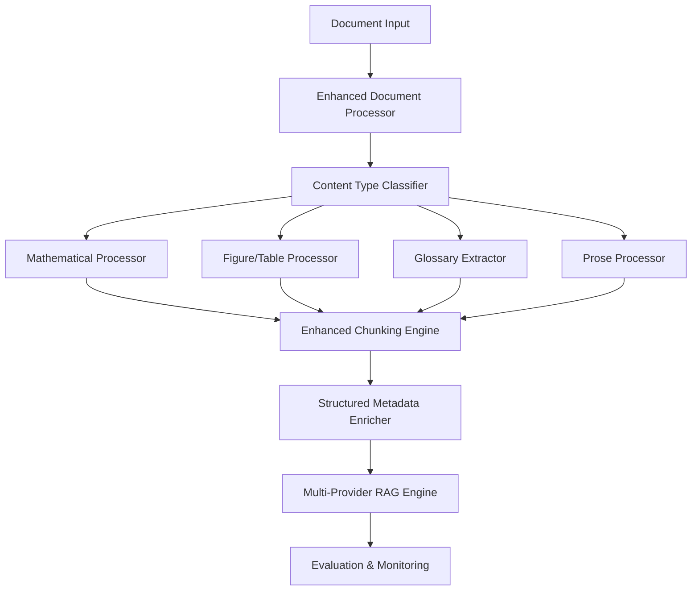

# RAGBook-SciRAG Integration Strategy

## Executive Summary

This document outlines a comprehensive strategy for integrating RAGBook's sophisticated document processing capabilities into SciRAG, creating a unified scientific RAG system that combines advanced mathematical content processing with multi-provider RAG capabilities.

## Table of Contents

1. [Current State Analysis](#current-state-analysis)
2. [Integration Architecture](#integration-architecture)
3. [Safety Strategy](#safety-strategy)
4. [Implementation Plan](#implementation-plan)
5. [Testing Framework](#testing-framework)
6. [Monitoring & Validation](#monitoring--validation)
7. [Rollback Strategy](#rollback-strategy)
8. [Risk Mitigation](#risk-mitigation)

## Current State Analysis

### RAGBook Strengths
- **Mathematical Content Processing**: Sophisticated LaTeX parsing and equation normalization
- **Content Type Classification**: Automatic detection of equations, figures, tables, prose
- **Structured Metadata**: Rich metadata extraction with content type classification
- **Advanced Chunking**: Sliding window approach with content-aware boundaries
- **Glossary Extraction**: Automatic technical term identification and definition extraction

### SciRAG Strengths
- **Multi-Provider Support**: Integration with OpenAI, Vertex AI, Gemini, Perplexity
- **Evaluation Framework**: Comprehensive evaluation and benchmarking capabilities
- **Cost Optimization**: Detailed cost tracking and efficiency analysis
- **Agent Integration**: Specialized agents for scientific knowledge retrieval
- **Production Ready**: Robust error handling and logging

### Integration Benefits
- Enhanced mathematical content processing for scientific documents
- Improved chunking strategies for better retrieval performance
- Rich metadata for more accurate content matching
- Unified interface for scientific document processing
- Better handling of complex scientific content types

## Integration Architecture

### Unified Document Processing Pipeline



### Key Components

1. **Enhanced Document Processor**
   - Integrates RAGBook's parsing capabilities
   - Maintains SciRAG's existing interfaces
   - Adds mathematical content processing

2. **Content Type Classifier**
   - Automatic detection of content types
   - Route processing based on content type
   - Maintain processing history

3. **Mathematical Processor**
   - LaTeX equation parsing and normalization
   - Mathematical token extraction
   - Equation metadata generation

4. **Enhanced Chunking Engine**
   - Content-aware chunking strategies
   - Sliding window approach for mathematical content
   - Preserve mathematical context across chunks

## Safety Strategy

### 1. Comprehensive Testing Framework

#### Unit Tests
```python
# scirag/tests/test_enhanced_processing.py
import pytest
from scirag.enhanced_processing import MathematicalProcessor, ContentClassifier

class TestMathematicalProcessing:
    def test_tex_normalize(self):
        processor = MathematicalProcessor()
        result = processor.process_equation(r"\frac{a}{b} = c")
        assert result['math_norm'] == "a/b=c"
        assert 'math_tokens' in result
    
    def test_equation_tokenization(self):
        processor = MathematicalProcessor()
        result = processor.process_equation(r"E = mc^2")
        expected_tokens = ['E', '=', 'm', 'c', '^', '2']
        assert result['math_tokens'] == expected_tokens
```

#### Integration Tests
```python
# scirag/tests/test_integration.py
class TestRAGBookIntegration:
    def test_end_to_end_processing(self):
        # Test complete document processing pipeline
        pass
    
    def test_backward_compatibility(self):
        # Ensure existing SciRAG functionality still works
        pass
```

#### Performance Tests
```python
# scirag/tests/test_performance.py
class TestPerformance:
    def test_processing_speed(self):
        # Benchmark processing speed
        pass
    
    def test_memory_usage(self):
        # Monitor memory consumption
        pass
```

### 2. Backward Compatibility Safeguards

#### Feature Flags
```python
# scirag/config.py
class SciRAGConfig:
    def __init__(self):
        self.enable_ragbook_processing = False  # Default: disabled
        self.enable_mathematical_processing = False
        self.enable_enhanced_chunking = False
```

#### Graceful Degradation
```python
# scirag/processing/fallback.py
class FallbackProcessor:
    def process_document(self, document):
        if self.config.enable_ragbook_processing:
            return self.enhanced_processor.process(document)
        else:
            return self.legacy_processor.process(document)
```

### 3. Rollback and Migration Strategies

#### Database Migration
```sql
-- Add new columns with default values
ALTER TABLE documents ADD COLUMN math_metadata JSONB DEFAULT '{}';
ALTER TABLE documents ADD COLUMN content_type VARCHAR(50) DEFAULT 'prose';
ALTER TABLE documents ADD COLUMN processing_version INTEGER DEFAULT 1;
```

#### Configuration Rollback
```python
# scirag/utils/rollback.py
class RollbackManager:
    def rollback_to_version(self, version):
        # Restore previous configuration
        # Revert database schema changes
        # Restore previous code version
        pass
```

### 4. Monitoring and Validation Systems

#### Health Checks
```python
# scirag/monitoring/health.py
class HealthChecker:
    def check_processing_pipeline(self):
        # Verify all processing components are working
        pass
    
    def check_data_integrity(self):
        # Validate processed data quality
        pass
    
    def check_performance_metrics(self):
        # Monitor processing speed and accuracy
        pass
```

#### Alerting System
```python
# scirag/monitoring/alerts.py
class AlertManager:
    def alert_on_processing_failure(self, error):
        # Send alerts for processing failures
        pass
    
    def alert_on_performance_degradation(self, metrics):
        # Alert on performance issues
        pass
```

## Implementation Plan

### Phase 1: Foundation (Weeks 1-2)
1. **Dependency Integration**
   - Add RAGBook as SciRAG dependency
   - Update `pyproject.toml` with new dependencies
   - Create virtual environment for testing

2. **Core Module Creation**
   - Create `scirag/enhanced_processing/` module
   - Implement `MathematicalProcessor` class
   - Implement `ContentClassifier` class

3. **Configuration Updates**
   - Add feature flags to configuration
   - Create environment-specific configs
   - Implement configuration validation

### Phase 2: Core Integration (Weeks 3-4)
1. **Document Processing Pipeline**
   - Integrate RAGBook parsing into SciRAG
   - Implement content type classification
   - Add mathematical content processing

2. **Enhanced Chunking**
   - Implement content-aware chunking
   - Add sliding window support
   - Preserve mathematical context

3. **Metadata Enhancement**
   - Add structured metadata extraction
   - Implement content type classification
   - Add mathematical metadata

### Phase 3: Testing & Validation (Weeks 5-6)
1. **Comprehensive Testing**
   - Implement unit tests
   - Create integration tests
   - Add performance benchmarks

2. **Backward Compatibility**
   - Test existing functionality
   - Implement fallback mechanisms
   - Validate configuration options

3. **Data Migration**
   - Create migration scripts
   - Test data integrity
   - Implement rollback procedures

### Phase 4: Deployment & Monitoring (Weeks 7-8)
1. **Gradual Rollout**
   - Deploy to development environment
   - Test with sample documents
   - Monitor performance metrics

2. **Production Deployment**
   - Deploy to staging environment
   - Run comprehensive tests
   - Deploy to production with feature flags

3. **Monitoring Setup**
   - Implement health checks
   - Set up alerting
   - Monitor performance metrics

## Testing Framework

### Test Categories

1. **Unit Tests**
   - Individual component testing
   - Mathematical processing validation
   - Content classification accuracy

2. **Integration Tests**
   - End-to-end processing pipeline
   - Multi-provider RAG integration
   - Database interaction testing

3. **Performance Tests**
   - Processing speed benchmarks
   - Memory usage monitoring
   - Scalability testing

4. **Regression Tests**
   - Backward compatibility validation
   - Existing functionality preservation
   - Configuration change testing

### Test Data

1. **Mathematical Documents**
   - LaTeX papers with equations
   - Markdown documents with math
   - Mixed content documents

2. **Scientific Papers**
   - Cosmology papers
   - Astrophysics papers
   - General scientific literature

3. **Edge Cases**
   - Malformed LaTeX
   - Large documents
   - Documents with mixed languages

## Monitoring & Validation

### Key Metrics

1. **Processing Metrics**
   - Document processing time
   - Mathematical content accuracy
   - Content classification accuracy

2. **Performance Metrics**
   - Memory usage
   - CPU utilization
   - Throughput rates

3. **Quality Metrics**
   - Retrieval accuracy
   - Generation quality
   - User satisfaction

### Monitoring Tools

1. **Application Monitoring**
   - Prometheus for metrics collection
   - Grafana for visualization
   - Custom dashboards for RAG-specific metrics

2. **Logging**
   - Structured logging with context
   - Error tracking and alerting
   - Performance profiling

3. **Health Checks**
   - Automated health monitoring
   - Dependency status checking
   - Data integrity validation

## Rollback Strategy

### Immediate Rollback
1. **Feature Flag Disable**
   - Disable RAGBook processing via configuration
   - Fall back to legacy processing
   - Maintain system functionality

2. **Code Rollback**
   - Revert to previous code version
   - Restore previous configuration
   - Validate system stability

### Data Rollback
1. **Database Rollback**
   - Restore previous database state
   - Validate data integrity
   - Update processing version

2. **Configuration Rollback**
   - Restore previous configuration
   - Validate system behavior
   - Monitor for issues

## Risk Mitigation

### Technical Risks

1. **Performance Degradation**
   - **Mitigation**: Comprehensive performance testing
   - **Monitoring**: Real-time performance metrics
   - **Response**: Automatic fallback to legacy processing

2. **Data Corruption**
   - **Mitigation**: Data validation and integrity checks
   - **Monitoring**: Automated data quality monitoring
   - **Response**: Immediate rollback and data restoration

3. **Integration Failures**
   - **Mitigation**: Extensive integration testing
   - **Monitoring**: Health checks and alerting
   - **Response**: Graceful degradation and fallback

### Operational Risks

1. **User Impact**
   - **Mitigation**: Gradual rollout with feature flags
   - **Monitoring**: User feedback and metrics
   - **Response**: Quick rollback and communication

2. **System Downtime**
   - **Mitigation**: Blue-green deployment strategy
   - **Monitoring**: Uptime monitoring
   - **Response**: Automatic failover and recovery

## Success Criteria

### Technical Success
- [ ] All existing SciRAG functionality preserved
- [ ] Mathematical content processing accuracy > 95%
- [ ] Processing performance within 10% of baseline
- [ ] Zero data loss or corruption
- [ ] Successful rollback capability demonstrated

### Business Success
- [ ] Improved retrieval accuracy for mathematical content
- [ ] Enhanced user experience with scientific documents
- [ ] Reduced processing time for complex documents
- [ ] Increased system reliability and stability

## Conclusion

This integration strategy provides a comprehensive approach to safely integrating RAGBook's capabilities into SciRAG while maintaining system stability and backward compatibility. The phased approach, extensive testing, and robust monitoring ensure a successful integration with minimal risk.

The key to success is the gradual rollout with feature flags, comprehensive testing at each phase, and the ability to quickly rollback if issues arise. This approach minimizes risk while maximizing the benefits of the enhanced document processing capabilities.
